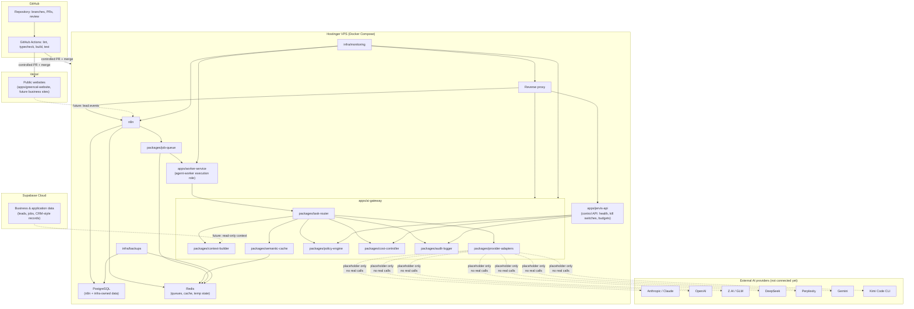

# Cloud Architecture

Status: durable reference for the Cost-Efficient Multi-Model Cloud
Infrastructure Preparation Stage. Records the target architecture; see
[DECISIONS.md](../../DECISIONS.md) ADR-0008 for the decision record and
scope note. Not auto-loaded — read when working on `apps/ai-gateway`,
`apps/jervis-api`, `apps/worker-service` (agent-worker role),
`packages/provider-adapters`, `packages/task-router`,
`packages/context-builder`, `packages/semantic-cache`,
`packages/policy-engine`, `packages/job-queue`, `packages/audit-logger`,
`packages/cost-controller`, or `infra/hostinger`, `infra/docker`,
`infra/monitoring`, `infra/backups`.

**Repository-preparation scope only.** Nothing in this document is
deployed, provisioned, or connected. No real credentials exist. See
ADR-0008's scope note before treating anything here as live.

## Why this exists

AI Company OS needs an always-on system that can eventually run on a
Hostinger VPS while the owner's computer is off, to help GreenCal (and
future businesses on the platform) generate and respond to leads,
improve estimate conversion, support SEO/AEO/GEO growth, support
commercial outreach, monitor website health, and automate repetitive
admin work — at minimum token/dollar cost per task. This document
describes the target shape; Stage 3+ of this repository-preparation
work builds the placeholder code and contracts that shape requires,
without turning any of it on.

## Service-to-platform assignment

| Service                                                                                             | Platform                                           | Status                                                                                            |
| --------------------------------------------------------------------------------------------------- | -------------------------------------------------- | ------------------------------------------------------------------------------------------------- |
| Public websites (`apps/greencal-website`, future business sites)                                    | **Vercel**                                         | Live today for greencal-website (ADR-0006)                                                        |
| Business/application data (leads, CRM-style records)                                                | **Supabase Cloud**                                 | Live today for greencal-website's quote form only (ADR-0006); broader use is future, per-business |
| Source control, branch protection, CI, PR review/approval                                           | **GitHub / GitHub Actions**                        | Live today (`.github/workflows/ci.yml`)                                                           |
| Reverse proxy, n8n, PostgreSQL (infra-owned), Redis, AI gateway, agent workers, monitoring, backups | **Hostinger VPS** (Docker Compose)                 | Not provisioned — templates only (`infra/docker/`, `infra/hostinger/`)                            |
| AI providers (Claude, OpenAI, GLM, DeepSeek, Perplexity, Gemini, Kimi)                              | External APIs, reached only through the AI gateway | Not connected — placeholder adapters only, no real calls                                          |

Kubernetes (`infra/k8s`, `infra/charts`) remains an unused planning stub —
ADR-0008 resolves the deployment-target decision in favor of Hostinger +
Docker Compose instead.

## Architecture diagram

## Provider substitution design

Every provider is reached only through `packages/provider-adapters`
behind the `ProviderAdapter` contract defined in `packages/agent-sdk`
(see [AI_PROVIDER_INTEGRATION.md](AI_PROVIDER_INTEGRATION.md)). The task
router (`packages/task-router`) never hardcodes a provider call directly
— it looks up a routing policy, resolves an adapter from a registry, and
checks that adapter's `healthStatus`/`killSwitchEnabled` before calling
it. This means:

- Disabling one provider (kill switch or health failure) does not stop
  the gateway from functioning — the router either uses the
  `substitutionRules.canBeSubstitutedBy` list on that provider's
  descriptor, or returns a clear `disabled-provider` error for tasks with
  no safe substitute, instead of crashing or silently calling an
  unapproved provider.
- Adding an eighth provider later means adding one adapter file and one
  registry entry — no router/gateway code changes.
- Removing a provider means deleting its adapter/registry entry — call
  sites depend only on the shared contract, not on any provider-specific
  shape.

## Core control-plane components

| Component        | Package/app                | Role                                                                                                                                        |
| ---------------- | -------------------------- | ------------------------------------------------------------------------------------------------------------------------------------------- |
| Provider gateway | `apps/ai-gateway`          | Single entry point that wires router, context builder, cache, policy engine, cost controller, audit logger, and adapters                    |
| Task router      | `packages/task-router`     | Deterministic-first routing: rules → single primary provider → bounded escalation                                                           |
| Context builder  | `packages/context-builder` | Builds a compact, task-scoped context package instead of sending full repos/CRM/history                                                     |
| Semantic cache   | `packages/semantic-cache`  | Exact/normalized-key response cache (Phase 1; true embedding-similarity matching is a documented future enhancement, not implemented)       |
| Policy engine    | `packages/policy-engine`   | Escalation-rule evaluation and authority-rule enforcement (no self-approval, no prod push, etc.) — companion to `config/policies/README.md` |
| Job queue        | `packages/job-queue`       | Bounded async work handoff between n8n/gateway and `apps/worker-service`                                                                    |
| Audit logger     | `packages/audit-logger`    | Secret-redacted, compliance-oriented event trail — distinct from `packages/telemetry`'s general instrumentation (ADR-0008)                  |
| Cost controller  | `packages/cost-controller` | Per-provider/per-agent/per-business budget tracking and kill switches                                                                       |
| Agent worker     | `apps/worker-service`      | Executes routed tasks pulled from the job queue (reuses the existing worker-service placeholder — ADR-0008)                                 |
| Control API      | `apps/jervis-api`          | Owner-facing control surface: health, budgets, kill switches, audit queries                                                                 |
| Scheduler        | n8n (Hostinger VPS)        | Cron-style triggers for recurring agent work (e.g., the GreenCal Website and Lead Health Agent)                                             |
| Approval queue   | GitHub pull requests       | Every code change from any provider/agent lands as a PR; owner approval gates merge                                                         |

## What this stage does not do

- No real AI provider account, API key, or network call.
- No Hostinger VPS provisioning or DNS/hosting change.
- No production deployment of any new app.
- No change to `apps/greencal-website` or its approved stack.
